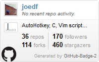
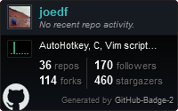

# github-badge-2
 
Simpler implementation, utilizing GitHub's GraphQL API, and fork of:  
https://github.com/berkerpeksag/github-badge

## Setup
### Option 1 - Self-Hosted
Simply update `config.json` with your username and github api_key that has user repo read access and user activity. Run the `generate_badge.py` script with python v3.4+, with `jinja2` and `requests` installed.

Then, set up a cron job or whatever you can use for a recurring / scheduled tasks to run the script periodically (something like every 24hrs) to update the generated `badge.html`. Or you can setup a free jinja webapp like on [pythonanywhere.com](https://pythonanywhere.com/) and simply check if the generated html exists or if modified date of the html file is greater than 1 day, see [example script](https://gist.github.com/joedf/84279ff7647d554a9d15f280a209c6b7).

Remember to set permissions to deny requests all files other than the generated html file.

### Option 2 - GitHub Actions & Pages
For GitHub Actions with GitHub Pages, see [update-badge-html.yml](.github/workflows/update-badge-html.yml) for example usage. You will need to add a GitHub token as `GH_BADGE_TOKEN` in the repository secrets. You will also need to set the GitHub Pages repository setting to use the `gh-pages` branch.

## Usage
You can then include the widget with the following code in similar form to:
```html
<iframe src="https://MyWebsite.com/badge.html" style="border:0;height:128px;width:200px;overflow:hidden;" frameBorder="0"></iframe>
```

## Dark theme / Night mode
You can use the dark theme by specifying `class="dark"` on `<body>` in the html template. Or you can add `?theme=dark` to the end of the URL used for the `iframe`.

## Preview
 
